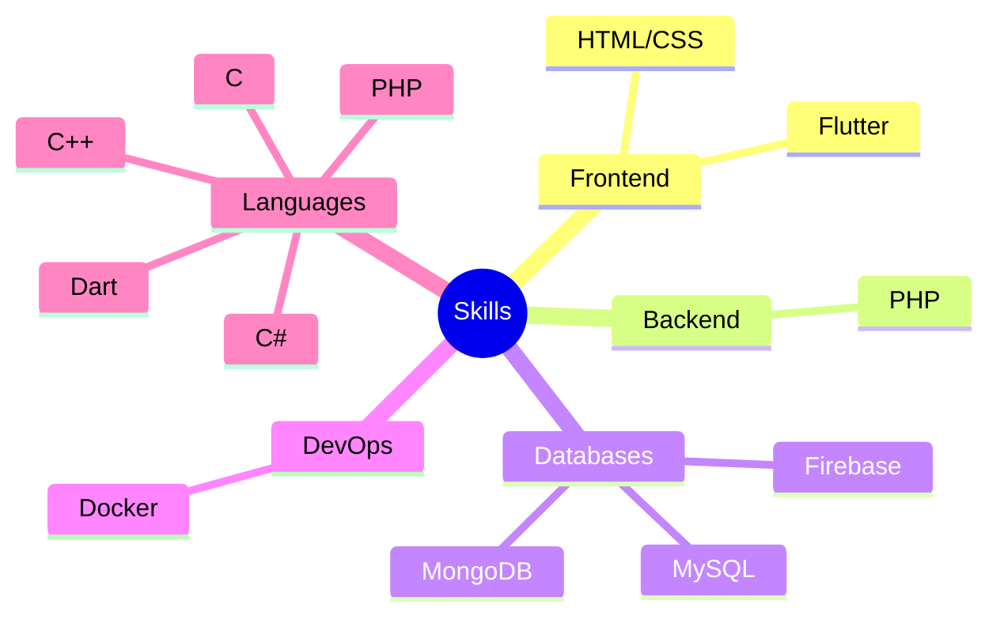

<h1 align="center">Hi 👋, I'm Ilyes</h1>
<h1 align="center">أهلا 👋، أنا إلياس</h1>

---

#### - 🧠 I’m currently learning **Flutter, go, php & js**
#### - 🖥️🎓 I'm studying computer science.
#### - 🔪 I'm a 3d hobbyist.
#### - 🎮 Intrested in game development.

<h3 align="center">Connect with me:</h3>

<h3 align="center">Languages and Tools:</h3>

<h3 align="center">Skills Map</h3>
 

<h3 align="center">Statistics</h3>
 

 
<a href="https://github.com/lias-e">

